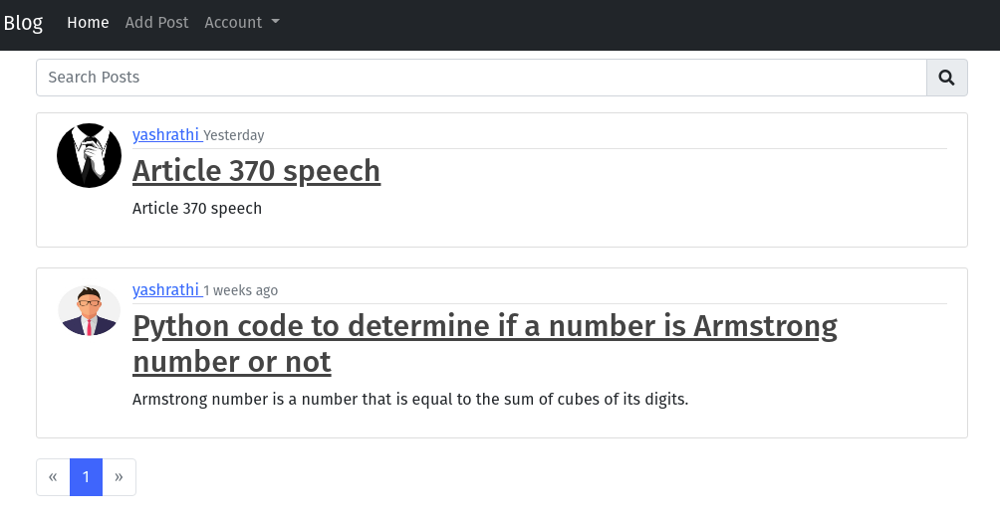

# Blog Webapp
> A blog webapp build with flask and bootstrap.




## Live Demo
https://awesome-flask-blog-app.herokuapp.com/

## Installation

1. Set the following environment variables\
**GMAIL ACCOUNT :** EMAIL & PASSWORD (For sending email from application)<br/>
SECRET_KEY (random string)

2. Install all dependencies listed in requirments.txt file.<br/>
```bash
>>> pip install -r requirements.txt
```

3. Restart terminal or cmd and naviage back to the project folder.Here run the following commands( to initialize SQLite database )<br/>
```bash
>>> flask db init
>>> flask db migrate -m "First migration"
>>> flask db upgrade
```
<br>
4. Finally, use `flask run` to run the local server.


